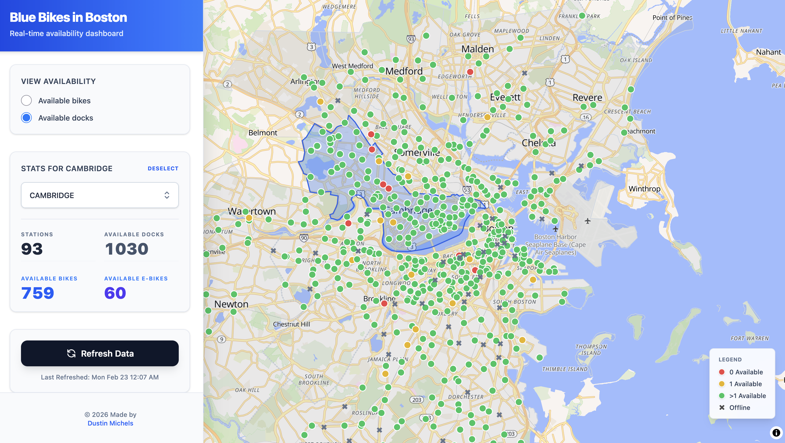

# Creating interactive web apps by leveraging AI

Dustin Michels | Tufts University | Feb 2026

The final product will be similar to this [Blue Bikes Dashboard](https://bluebike.netlify.app/).

## Contents

- [Part 1: How the web works](/part1_the_web.md)
- [Part 2: Scraping data from the web](/part2_web_scraping.md)
- [Part 3: Building a web app with AI](/part3_vibe_coding.md)
