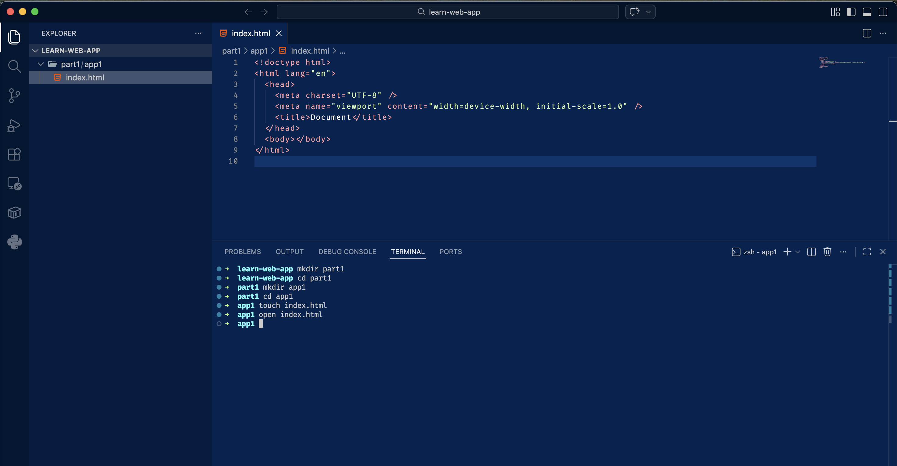

# Part 1: How the web works

## Overview

Web sites are documents made up of HTML, CSS, and JavaScript.

- **HTML** is the structure of the page
- **CSS** adds style
- **JavaScript** adds interactivity
  - **JSON** can be used for data


---

A **server** hosts the files that make up a website and serves them to users when they visit the site.

- The server must speak the _HTTP protocol_, which is how browsers communicate with servers.


---

A **DNS server** translates domain names (like google.com) into IP addresses (like 74.125.224.72) for servers.


## Setup

- Install [VSCode](https://code.visualstudio.com/download)
- Create a folder for this project and open it in [VSCode](https://code.visualstudio.com/download).
- _Recommended_
  - Install the "prettier" extension for VSCode
  - Turn on "format on save" in VSCode settings

Create a folder called "part1"

```sh
# create folder for part 1
mkdir part1

# navigate into part 1
cd part1
```

## App1 - Create a webpage

In [VSCode](https://code.visualstudio.com/download), create a folder called "app1"

You can do this by clicking, or with terminal commands:

```sh
# create app
mkdir app1

# navigate into app
cd app1

# create index.html
touch index.html
```

Folder structure:

```txt
.
└── part1
    └── app1
        └── index.html
```

Create a basic HTML file using "! + tab" in VSCode, or copy and paste the following into `index.html`:

```html
<!doctype html>
<html lang="en">
  <head>
    <meta charset="UTF-8" />
    <meta name="viewport" content="width=device-width, initial-scale=1.0" />
    <title>Document</title>
  </head>
  <body></body>
</html>
```

Open in the browser

```sh
open index.html
```



### Add some content (HTML)

_Inside the body tag_, try adding a heading and a paragraph:

```html
<h1>Hello World</h1>
<p>This is my first website</p>
```

You could also add a bulleted list:

```html
<ul>
  <li>Item 1</li>
  <li>Item 2</li>
  <li>Item 3</li>
</ul>
```

You can add a div. A div is a container that can hold other elements.

```html
<div>This is stuff inside a div</div>
```

It doesn't do anything by itself, but it can be used to group elements together and apply styles to them.

```html
<div style="border: 1px solid black">This is stuff inside a div</div>
```

Let's also add an inline style to the header:

```html
<h1 style="color: red">Hello World</h1>
```

Complete code:

```html
<!doctype html>
<html lang="en">
  <head>
    <meta charset="UTF-8" />
    <meta name="viewport" content="width=device-width, initial-scale=1.0" />
    <title>Document</title>
  </head>
  <body>
    <h1 style="color: red">Hello World</h1>
    <p>This is my first website</p>
    <ul>
      <li>Item 1</li>
      <li>Item 2</li>
      <li>Item 3</li>
    </ul>
    <div style="border: 1px solid black">This is stuff inside a div</div>
  </body>
</html>
```
