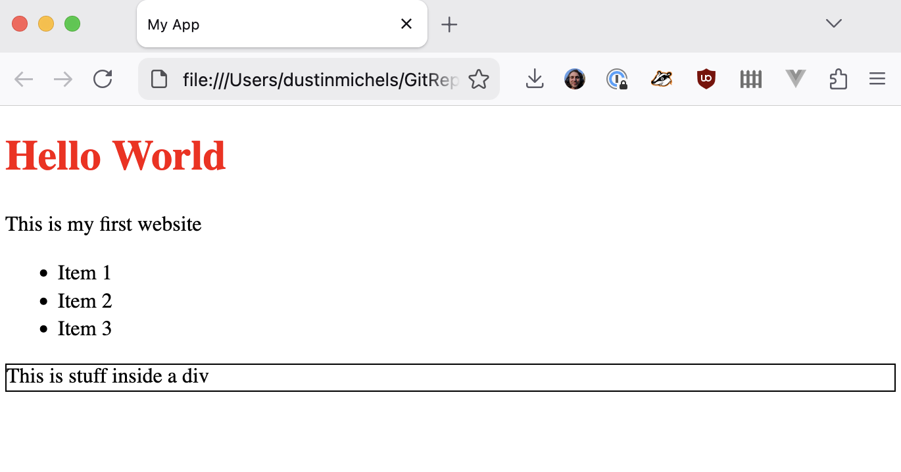

# Part 1: How the web works

## Overview

Web sites are documents made up of HTML, CSS, and JavaScript.

- **HTML** is the structure of the page
- **CSS** adds style
- **JavaScript** adds interactivity
  - **JSON** can be used for data


---

A **server** hosts the files that make up a website and serves them to users when they visit the site.

- The server must speak the _HTTP protocol_, which is how browsers communicate with servers.


---

A **DNS server** translates domain names (like google.com) into IP addresses (like 74.125.224.72) for servers.


## Setup

- Create a folder for this project and open it in [VSCode](https://code.visualstudio.com/download).
- _Recommended_
  - Install the "prettier" extension for VSCode
  - Turn on "format on save" in VSCode settings

Create a folder called "part1"

```sh
# create folder for part 1
mkdir part1

# navigate into part 1
cd part1
```

## App1 - Create a webpage

In [VSCode](https://code.visualstudio.com/download), create a folder called "app1"

You can do this by clicking, or with terminal commands:

```sh
# create app
mkdir app1

# navigate into app
cd app1

# create index.html
touch index.html
```

Folder structure:

```txt
.
└── part1
    └── app1
        └── index.html
```

Create a basic HTML file using "! + tab" in VSCode, or copy and paste the following into `index.html`:

```html
<!doctype html>
<html lang="en">
  <head>
    <meta charset="UTF-8" />
    <meta name="viewport" content="width=device-width, initial-scale=1.0" />
    <title>Document</title>
  </head>
  <body></body>
</html>
```

Open in the browser

```sh
open index.html
```

_Inside head tag_, try changing title then refresh the page:

```html
<title>My App</title>
```

### Add content (HTML)

_Inside the body tag_, try adding a heading and a paragraph:

```html
<h1>Hello World</h1>
<p>This is my first website</p>
```

You could also add a bulleted list:

```html
<ul>
  <li>Item 1</li>
  <li>Item 2</li>
  <li>Item 3</li>
</ul>
```

You can add a div. A div is a container that can hold other elements.

```html
<div>This is stuff inside a div</div>
```

It doesn't do anything by itself, but it can be used to group elements together and apply styles to them.

```html
<!-- Update your div -->
<div style="border: 1px solid black">This is stuff inside a div</div>
```

Let's also add an inline style to the header:

```html
<h1 style="color: red">Hello World</h1>
```

Complete code:

```html
<!doctype html>
<html lang="en">
  <head>
    <meta charset="UTF-8" />
    <meta name="viewport" content="width=device-width, initial-scale=1.0" />
    <title>My App</title>
  </head>
  <body>
    <h1 style="color: red">Hello World</h1>
    <p>This is my first website</p>
    <ul>
      <li>Item 1</li>
      <li>Item 2</li>
      <li>Item 3</li>
    </ul>
    <div style="border: 1px solid black">This is stuff inside a div</div>
  </body>
</html>
```



### Add style (CSS)

You can separate the style into a css file.

Create a file called `style.css` in the same folder as `index.html`:

```sh
touch style.css
```

Files:

```txt
.
└── part1
    └── app1
        ├── index.html
        └── style.css
```

Then add the following code to `style.css`:

```css
h1 {
  color: red;
}
```

Back in the `index.html` file, remove the inline style from the h1 element and add a link to the css file:

```html
<head>
  (...)
  <link rel="stylesheet" href="style.css" />
</head>
<body>
  (...)
  <h1>Hello World</h1>
  (...)
</body>
```

You can use classes to apply styles to certain elements.

Change the html for the div to have a class of "box":

```html
<!-- Remove -->
<!-- <div style="border: 1px solid black">This is stuff inside a div</div> -->

<!-- Add -->
<div class="box">This is stuff inside a div</div>
```

And the css:

```css
.box {
  border: 1px solid black;
  padding: 10px;
}
```

Let's also change the font for all the text on the page:

```css
body {
  font-family: Arial, sans-serif;
}
```

Complete code:

`part1/app1/index.html`

```html
<!doctype html>
<html lang="en">
  <head>
    <meta charset="UTF-8" />
    <meta name="viewport" content="width=device-width, initial-scale=1.0" />
    <title>My App</title>
  </head>
  <body>
    <h1 style="color: red">Hello World</h1>
    <p>This is my first website</p>
    <ul>
      <li>Item 1</li>
      <li>Item 2</li>
      <li>Item 3</li>
    </ul>
    <div class="box">This is stuff inside a div</div>
  </body>
</html>
```

`part1/app1/style.css`

```css
body {
  font-family: Arial, sans-serif;
}

h1 {
  color: red;
}

.box {
  border: 1px solid black;
  padding: 10px;
}
```

### Add functionality (JavaScript)

Create an empty JavaScript file called `script.js` in the same folder as `index.html`:

```sh
touch script.js
```

Files:

```txt
.
└── part1
    └── app1
        ├── index.html
        ├── style.css
        └── script.js
```

In the html file add a button and a link to a javascript file:

```html
<body>
  (...)
  <button id="myButton">Change header color</button>
  <script src="script.js"></script>
</body>
```

In the `script.js` file, add the following code to change the color of the header when the button is clicked:

```js
// get the button and header elements
const button = document.getElementById("myButton");
const header = document.querySelector("h1");

// make a list of colors
const colors = ["red", "blue", "green", "orange", "purple"];

// create a counter and set it to 0
// set header to the first item in the list
let counter = 0;
header.style.color = colors[counter];

// add a click event listener to the button
button.addEventListener("click", () => {
  // increment the counter
  counter = (counter + 1) % colors.length;
  // change the color of the header
  header.style.color = colors[counter];
});
```

Refresh the page. When you click the button, the color of the header should change.

To understand how this code works, you could run it line by line in the browser console. Open the console by right-clicking on the page and selecting "Inspect" or "Inspect Element", then go to the "Console" tab.

Complete code:

`part1/app1/index.html`

```html
<!doctype html>
<html lang="en"></html>
<head>
  <meta charset="UTF-8" />
  <meta name="viewport" content="width=device-width, initial-scale=1.0" />
  <title>My App</title>
  <link rel="stylesheet" href="style.css" />
</head>
<body>
  <h1>Hello World</h1>
  <p>This is my first website</p>
  <ul>
    <li>Item 1</li>
    <li>Item 2</li>
    <li>Item 3</li>
  </ul>
  <div class="box">This is stuff inside a div</div>
  <button id="myButton">Change header color</button>
  <script src="script.js"></script>
</body>
```

`part1/app1/script.js`

```js
// get the button and header elements
const button = document.getElementById("myButton");
const header = document.querySelector("h1");
// make a list of colors
const colors = ["red", "blue", "green", "orange", "purple"];
// create a counter and set it to 0
// set header to the first item in the list
let counter = 0;
header.style.color = colors[counter];
// add a click event listener to the button
button.addEventListener("click", () => {
  // increment the counter
  counter = (counter + 1) % colors.length;
  // change the color of the header
  header.style.color = colors[counter];
});
```
